# IDRiDSegmentation

Code for Segmentation of retinal lesions associated with diabetic retinopathy as microaneurysms, hemorrhages, hard exudates, and soft exudates.

It's distributed under the GNU General Public License v3 (or any later
  version) - see the accompanying LICENSE file for more details.

## Requirements

You need to have the following python packages installed (may be incomplete):

- tensorflow 1.X
- opencv
- numpy
- scipy
- sklearn
- matplotlib
- PIL
- pandas
- You need to have downloaded at least the IDRiD training dataset.

## Samples

|    Ground Truth(HE)    |        Predicted         |
| :-------------------: | :----------------------: |
| 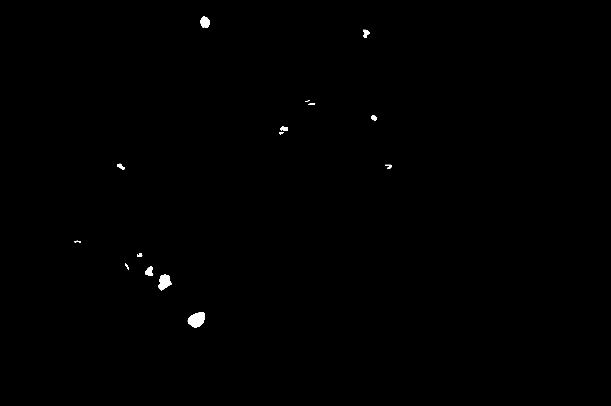 | 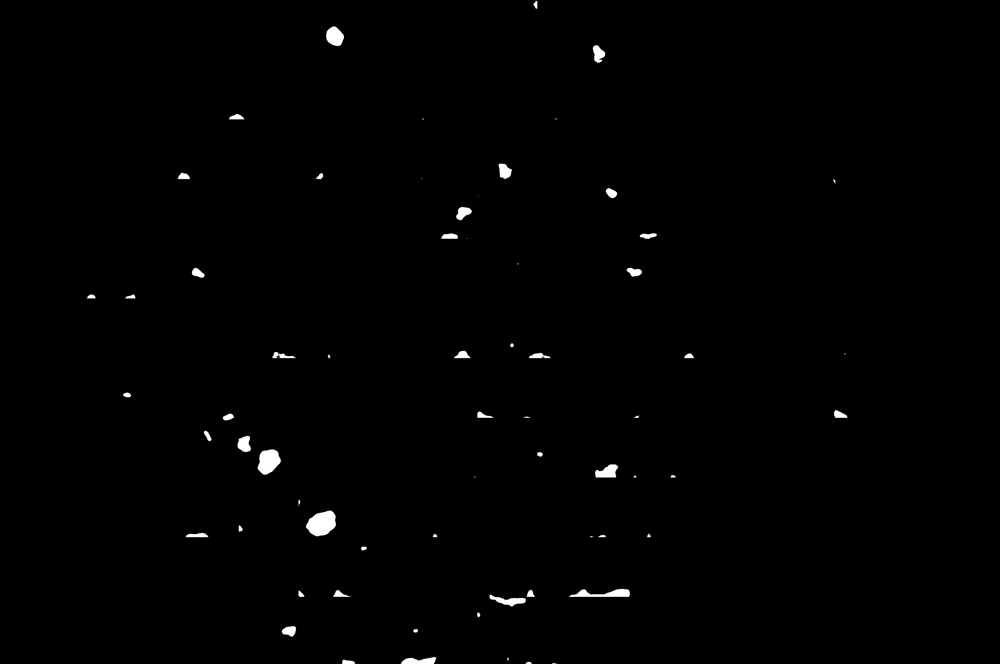 |
| 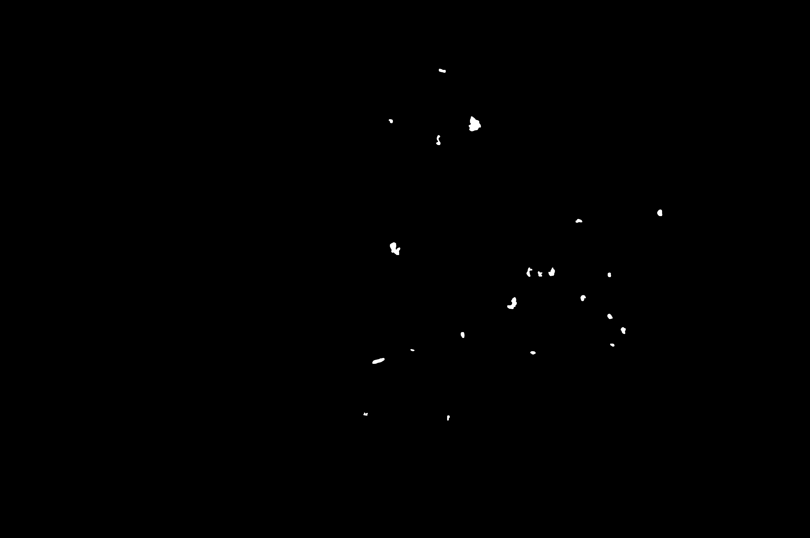 | 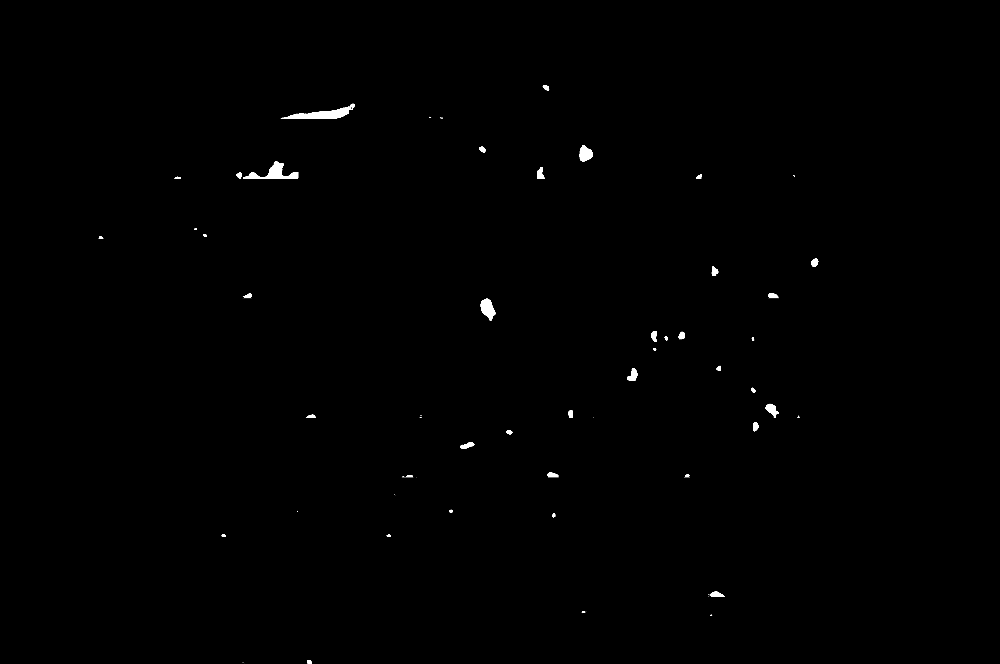 |
| 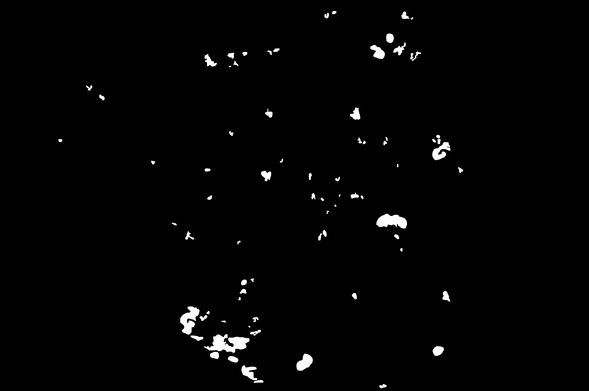 | 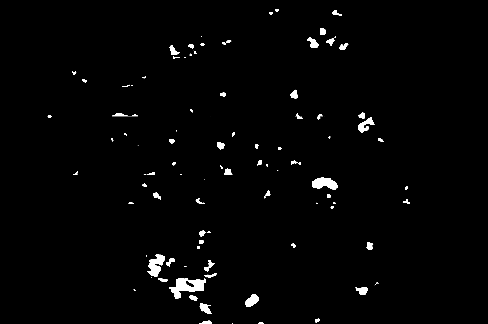 |
| 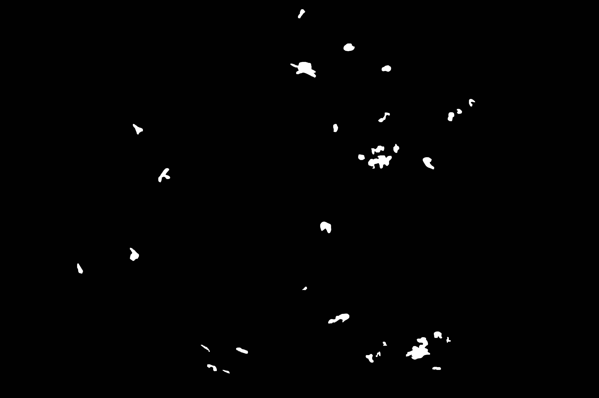 | 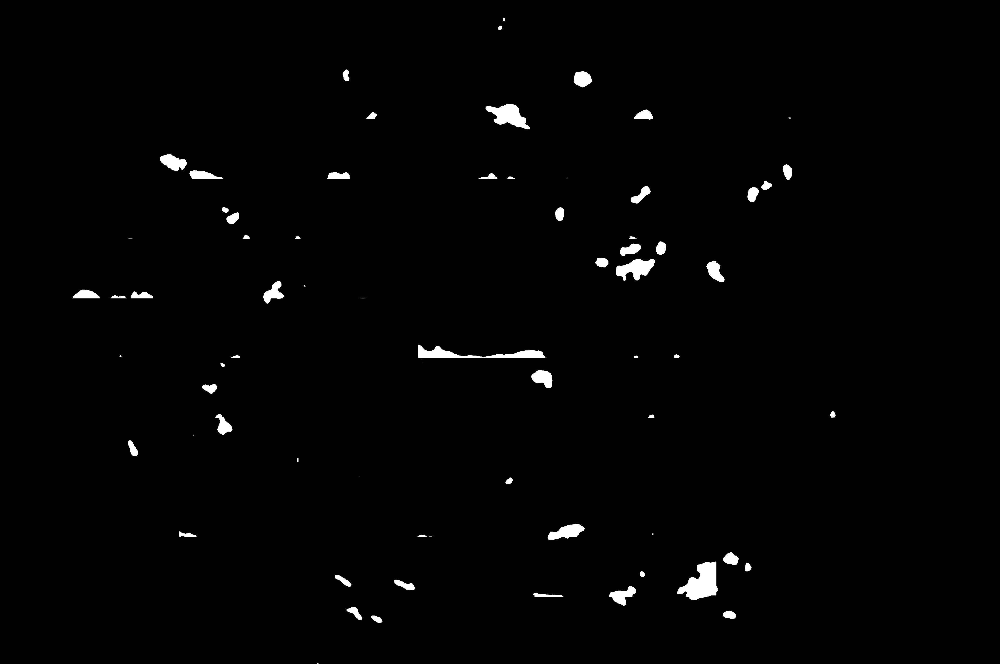 |
|  | 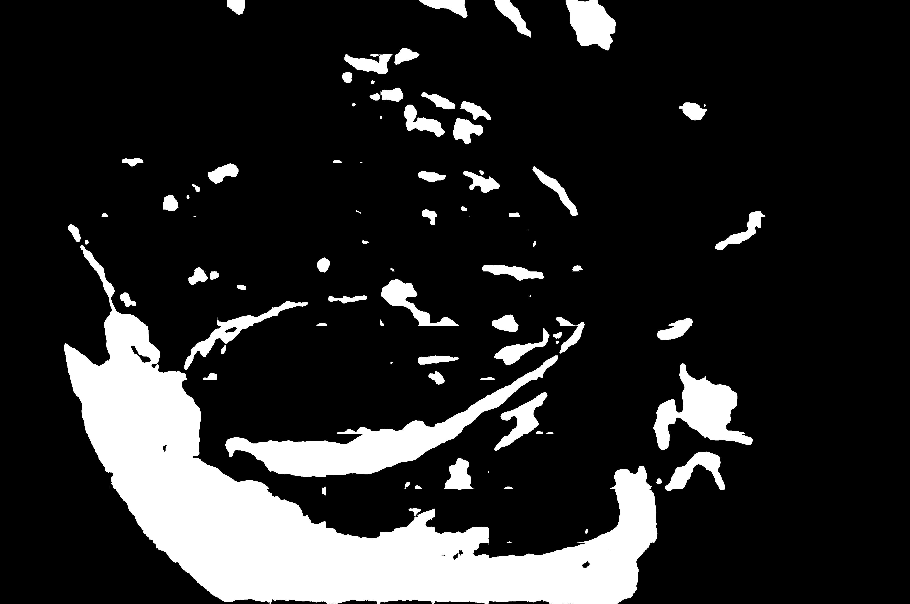 |
| 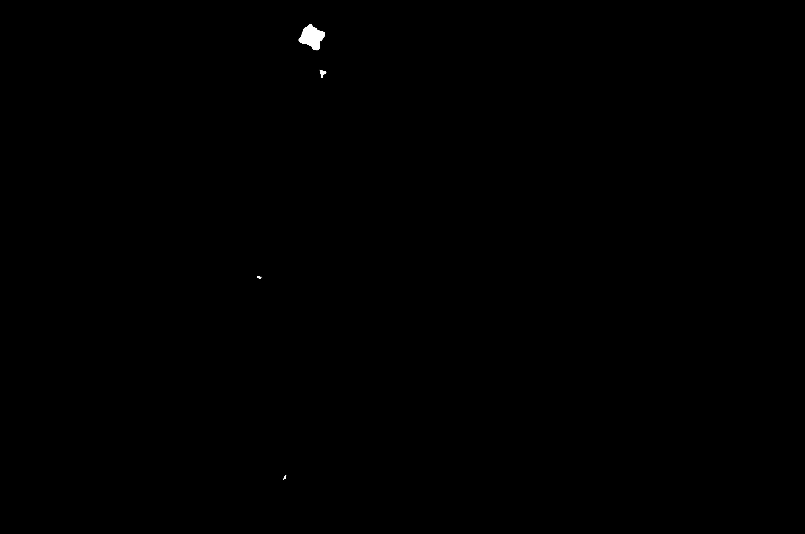 | 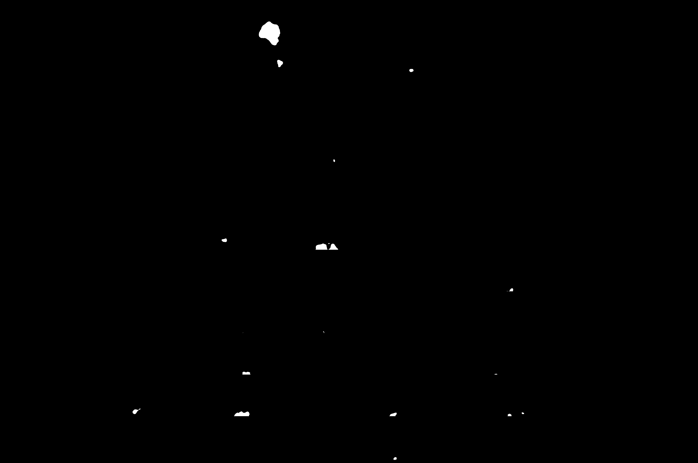 |
***

## Contributors

- **[Himanshu Agarwal](https://github.com/HimanshuAgarwal022)**

- **[Jayesh Narayan](https://github.com/jayesh1narayan)**

***

## Citations

**[IDRiD Challenge](https://idrid.grand-challenge.org/)**
***
